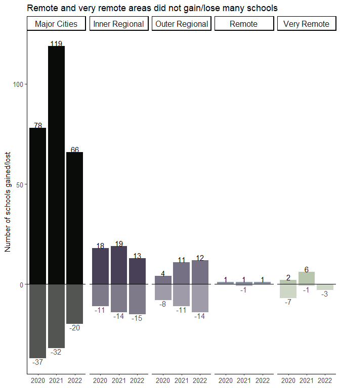

2023, Week 15: Regionality of new and disestablished schools
================
Tim Kelso
12 April, 2023

# Background

## Data source

Data from Australian Curriculum, Assessment and Reporting Authority
(ACARA) (<https://acara.edu.au/contact-us/acara-data-access>).

## Data information

*ACARA_school_location\_.xlsx* List of all Australian schools, Long/Lat,
LGA

*ACARA_school_profile\_.xlsx* List of all Australian schools,
enrolments, ICSEA, LBOTE, SEA

# Analysis

## Initial thoughts

- What state has gained the most/least number of schools since 2019?  
- How many schools were gained in major cities vs regional areas?
- How many schools were lost in major cities vs regional areas?

## Columns of potential interest:

- Geolocation  
- ICSEA

## Graphs

### Total number of schools in Australia 2019-2022

I’ll start with a simple count of total schools in Australia using
school_location data from 2019 to 2022:

    ## # A tibble: 1 × 4
    ##   `2019` `2020` `2021` `2022`
    ##    <int>  <int>  <int>  <int>
    ## 1  10507  10547  10644  10684

### Gained and lost schools 2019-2022

The above shows the final number of schools each year. Let’s find how
many schools were lost and gained in each year from 2019 onwards.

<!-- -->
\### Did major cities or regional areas gain or lose more schools?  
<!-- -->

### Which regional areas gain or lose more schools?

<!-- -->

# Key Takeaways

- Most new schools are established in major cities, with a net growth in
  the total number of schools  
- Some schools are established in regional areas, but this is offset by
  an equivalent number of schools that are lost

# Possible next steps
