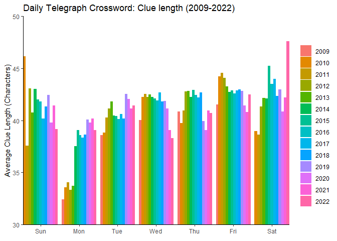

TidyTuesday: 21Apr2022
================

Data source:
<https://towardsdatascience.com/the-wild-world-of-crossword-data-71d560e222f5>

<!-- -->

# Key Takeaways

-Clue length appears to increase from Monday to Saturday, then drops
down on Sunday  
-Monday and Saturday clues have become markedly longer whilst Sunday
clues have become much shorter

# Possible next steps

-Use a better colour scheme  
-Compare to New York Times Crossword data  
-Compare fewer years (reduce noise)  
-Examine weekly trends by year, for instance with line graphs  
-Predict changes for upcoming years
