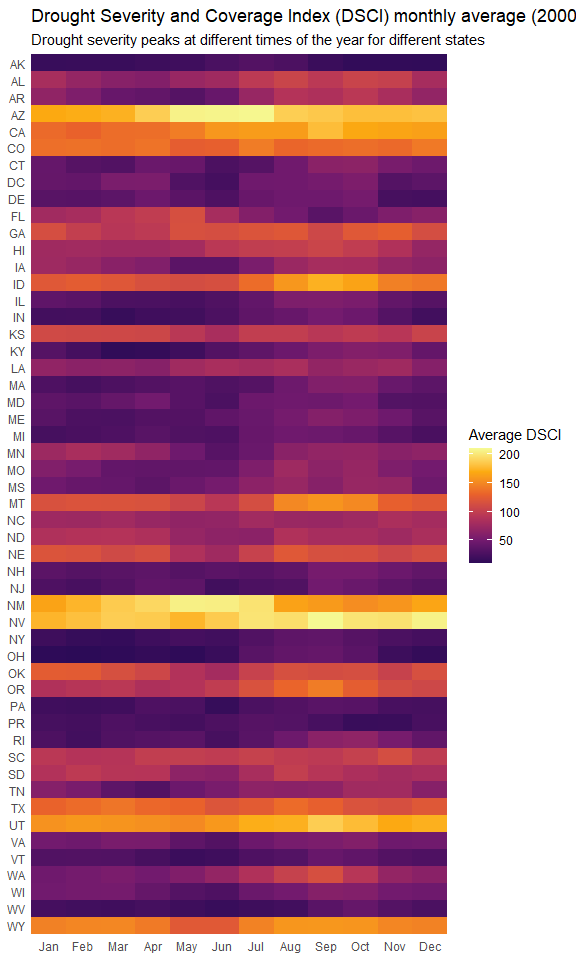
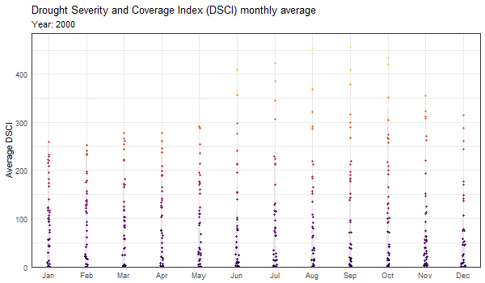
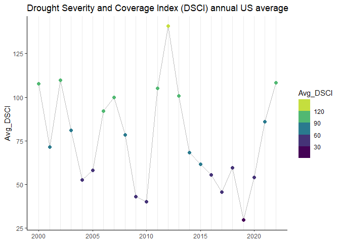
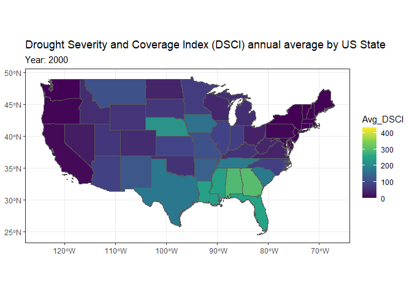

TidyTuesday Week 24, 2022: Drought Conditions in the US
================
Tim Kelso
29 June, 2022

# Background

## Data source

Data from National Integrated Drought Information System
(<https://www.drought.gov/>).

## Data information

*drought.csv* The Standardized Precipitation Index (SPI) is an index to
characterize meteorological drought on a range of timescales, ranging
from 1 to 72 months, for the lower 48 U.S. states. The SPI is the number
of standard deviations that observed cumulative precipitation deviates
from the climatological average. NOAA’s National Centers for
Environmental Information produce the 9-month SPI values below on a
monthly basis, going back to 1895. **(From
<https://www.drought.gov/historical-information?dataset=1&selectedDateUSDM=20110301&selectedDateSpi=19580901>)**

*drought_fips.csv* The Drought Severity and Coverage Index is an
experimental method for converting drought levels from the U.S. Drought
Monitor map to a single value for an area. DSCI values are part of the
U.S. Drought Monitor data tables. Possible values of the DSCI are from 0
to 500. Zero means that none of the area is abnormally dry or in
drought, and 500 means that all of the area is in D4, exceptional
drought.

FIPS id: first two digits = state, last 3 digits = county
<https://walker-data.com/tidycensus/reference/fips_codes.html>

# Analysis

## Initial thoughts

-   What state has endured the most/least drought since 2000?  
-   Map of average DSCI for each state (heatmap) from 2000 - 2022
-   Map of average DSCI for each county (heatmap) from 2000 - 2022
-   Scatterplot/violin/density/raincloud plot of average DSCI by month
    (all counties/states)
-   Using additional census data, in which state/county have the most
    people been affected by drought?

## Tables/Columns of potential interest:

-   FIPS: separate into state (first two digits) and county (last three
    digits)  
-   DSCI: measure of drought severity in an area

## Graphs

### Examining drought using a monthly average of DSCI

I will begin by examining how different states experience drought across
the year, using data from 2000 to 2022:  
<!-- -->
Visualised over time here:  
<!-- -->
### Examining drought using an annualised average of DSCI  
This approach will demonstrate a broad yearly trend.

Here, I look at drought severity in the US as a whole,  
<!-- -->
and drought severity by State here:  
<!-- -->

and here:  
<!-- -->

# Key Takeaways

-   Drought intensity varies greatly by state and year
-   California has experienced some of the most intense droughts since
    2000  
-   In some years, drought is widespread. In other years, it is more
    localised.
-   The average annual drought intensity across the US was highest in
    2012 and lowest in 2019

# Possible next steps

-   Examine/visualise data at monthly average drought intensity rather
    than current annual average
-   Integration of population data - where are the most people affected
    by drought?
