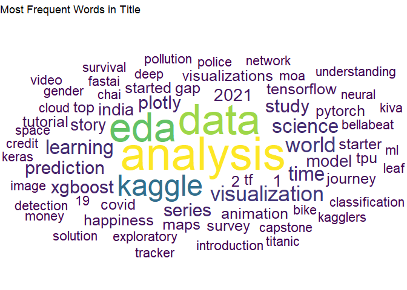
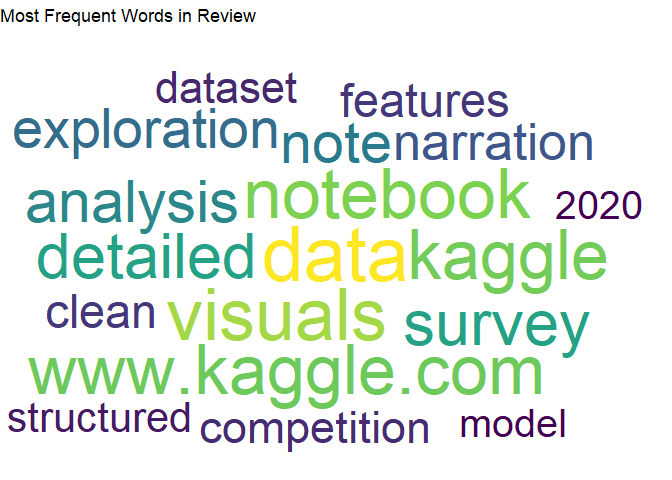
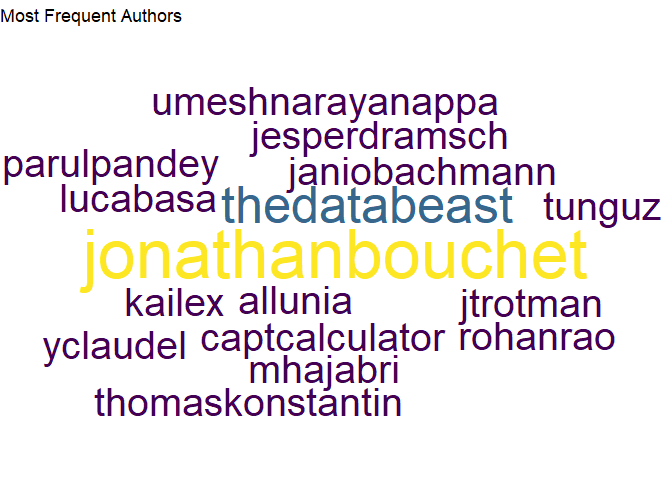

TidyTuesday: 27Apr2022
================
Tim Kelso

# Background

## Data source

<https://www.kaggle.com/code/headsortails/hidden-gems-a-collection-of-underrated-notebooks/report>

## Data information

The file of interest is kaggle_hidden_gems.csv, containing the following
columns:

vol and date: The consecutive number of the Hidden Gems episode and when
it was first published.

link_forum and link_twitter: The hyperlinks to the Kaggle Forum post and
Twitter post for the episode.

notebook and author: The hyperlinks to the Notebook itself, as well as
to the Kaggle profile of the author.

title: The Notebook title as a string.

review: My brief review of the Notebook.

author_name: The name of the Notebook author as listed on their Kaggle
profile at the time the episode was published.

author_twitter and author_linkedin: The social media links of the
author, if listed on their Kaggle profile.

notes: Notes about special episodes.

# Analysis

## Columns of potential interest:

-   author_kaggle - are there many authors with multiple Hidden Gems
    entries?  
-   Title - how many titles are structured as questions?  
-   Title - what are the most frequent words included in titles?  
-   Title - what are the most frequent countries included in titles?  
-   Review - what are the most frequent words included in reviews?  
-   Author_twitter - how many authors have linked their twitter
    accounts?  
-   Author_linkedin - how many authors have linked their linkedin
    accounts?  
-   Author_linkedin & \_twitter - how many authors have both, and what
    is the overlap?

<!-- -->

| Titles with questions | Total number of Titles | Proportion of Titles that included Questions (%) |
|:----------------------|:-----------------------|:-------------------------------------------------|
| 32                    | 300                    | 10.7                                             |

<!-- -->

<!-- -->

# Key Takeaways

-Lots of Hidden Gems titles focus on analysis, data, and exploratory
data analysis (eda), which is not a huge shock! Other frequently used
words include visualisation, world, learning, science, and time.  
-Most titles (89%) did not include a question, in line with the
predominance of exploratory data analysis that would not lend itself to
a specific focus in such a form  
-Reviews contain many mentions of data and visuals, with notebook and
kaggle also featuring high up the list. Next on the list are detailed,
survey, and analysis.  
-The most featured Author in Hidden Gems is jonathonbouchet with 9
reviews, followed by thedatabeast (5 reviews). Next on the list are lots
of Authors with 3 reviews, with an honourable mention to captcalculator
for an amazing kaggle username.

# Possible next steps

-Fix up colour scheme in wordclouds  
-Improve look and feel of table  
-Title - what are the most frequent countries included in titles?  
-Author_twitter - how many authors have linked their twitter accounts?  
-Author_linkedin - how many authors have linked their linkedin
accounts?  
-Author_linkedin & \_twitter - how many authors have both, and what is
the overlap?
