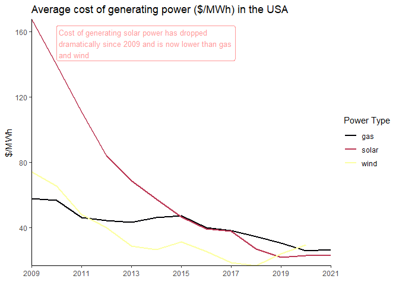

Solar/Wind utilities in USA: TidyTuesday Week 18, 2022
================
Tim Kelso
06 May, 2022

# Background

## Data source

<https://emp.lbl.gov/utility-scale-solar>

## Data information

Berkeley Lab’s “Utility-Scale Solar, 2021 Edition” presents analysis of
empirical plant-level data from the U.S. fleet of ground-mounted
photovoltaic (PV), PV+battery, and concentrating solar-thermal power
(CSP) plants with capacities exceeding 5 MWAC. While focused on key
developments in 2020, this report explores trends in deployment,
technology, capital and operating costs, capacity factors, the levelized
cost of solar energy (LCOE), power purchase agreement (PPA) prices, and
wholesale market value.

# Initial thoughts

## Data

-   Capacity: Time series data of power generation capacity, from
    2014-2020, for solar, wind, storage, gas, nuclear, coal, other.
    \_prior and \_new are cumulative totals?  
-   Average_cost: Average cost of gas, solar, wind per mWh from
    2014-2020 (table needs pivot_longer)  
-   Wind: Cost and capacity, with a more granular time scale  
-   Solar: Cost and capacity, with a more granular time scale

## Key questions

1.  How has capacity and average cost of energy generation changed from
    2014-2020?  
2.  Is there a correlation between the capacity of energy sources (wind,
    solar, gas) and average cost?

# Analysis

## Graphs of potential interest

-   Simple line graph of gas vs solar vs wind total capacity from
    2014-2020 (capacity)  
-   Simple line graph of gas vs solar vs wind average_cost from
    2014-2020 (average_cost)  
-   Comparison of average cost vs capacity for gas, solar, wind
    (capacity, average_cost)  
-   Standalone prior vs standalone new over time for solar, wind,
    storage, gas, nuclear, coal, other (capacity)  
-   Hybrid prior vs hybrid new for solar, wind, storage, gas, nuclear,
    coal, other (capacity)

## Graphs

<!-- -->

    ## Warning: Removed 1 row(s) containing missing values (geom_path).

<!-- -->

# Key Takeaways

-   Solar power capacity has risen sharply against all other forms since
    2014, whilst it’s average cost has dropped dramatically since 2009
    and is now lower than gas and wind  
-   Wind power capacity has stagnated since 2018, matched by an
    increased cost in generating this type of energy during this period
-   Cost of gas power generation has decreased since 2009, despite
    reduced gas power capacity since 2014

# Possible next steps

-   Improve visuals of graphs - colours, font, label doesn’t really
    stand out  
-   Visualise capacity vs average cost for solar, wind, and gas  
-   Take a deeper look at recent solar and wind trends using more
    detailed data from individual days/months
