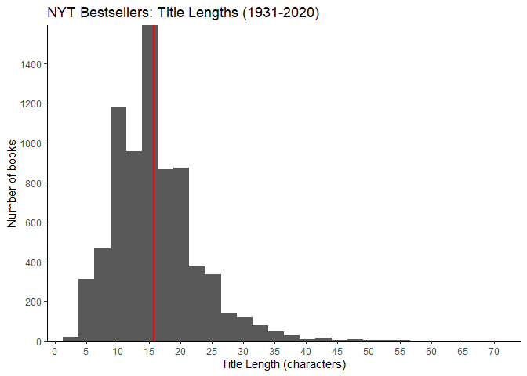
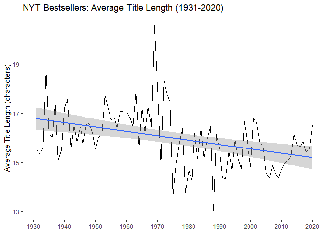
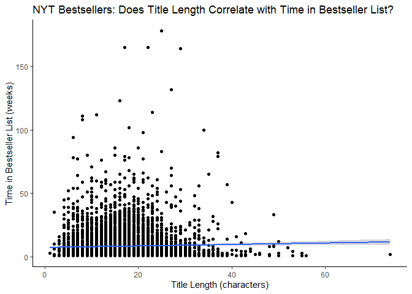
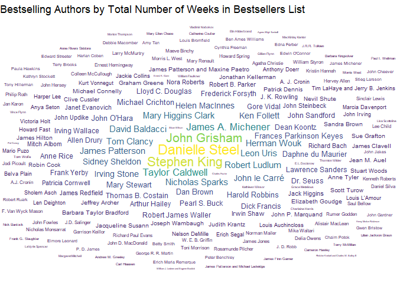
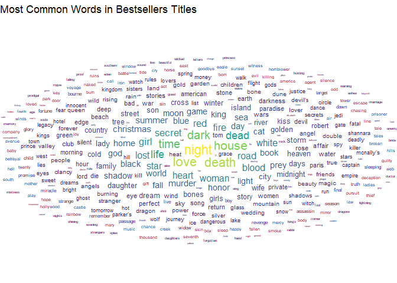

TidyTuesday Week 19: NYT Bestsellers
================
Tim Kelso
11 May, 2022

# Background

## Data source

Data from Post45 Data
(<https://data.post45.org/wp-content/uploads/2022/01/NYT-Data-Description.pdf>)
## Data information  
Fiction bestseller list between 1931 and 2020. Each row of the dataset
is a single “entry” on the list - single slot for a single week

*nyt_full.tsv* - year: the year of appearance  
- week: the weekly issue of the bestseller list - rank: the book’s rank
on the list for that week  
- title_id: a unique ID mapping titles to the nyt_titles spreadsheet  
- title: title of the novel, as reported by the New York Times  
- author: author of the novel, as reported by the New York Times

*nyt_titles.tsv* - id: an arbitrary unique id for the novel  
- title: the title of the novel, as reported by the New York Times  
- author: the author of the novel, as reported by the New York Times  
- year: the first year that the novel appears on the bestseller list.
Note that this year may be different from the publication year.  
- total_weeks: the total number of weeks the title was on the list -
first_week: the first week that the novel appears on the bestseller list
- debut_rank: the book’s bestseller rank in the week of its first
appearance - best_rank: the highest rank achieved by the title while on
the list

# Analysis

## Initial thoughts

-   What is the average title length? Does this change over time?  
-   Do shorter/longer titles stay longer on the list?  
-   Who is the most prolific author since 1931?  
-   

## Tables/Columns of potential interest:

-   Line graph - average title length by year (nyt_full)  
-   Total weeks by title length (nyt_titles)  
-   Wordcloud of author frequency in total weeks (nyt_full)

## Graphs

<!-- -->

<!-- -->

<!-- -->
<!-- -->
<!-- -->

# Key Takeaways

-   Average title length of NYT bestseller books is \~15 characters
    (1931-2020)  
-   Average title length is on a downward trend since 1931  
-   There is not a strong relationship between title length and total
    weeks in the bestseller list  
-   Books by Danielle Steel, Stephen King, and John Grisham have spent
    the longest time in the bestseller list  
-   “Night”,“Love”, “Death”, “House”, “Dark”, and “Time”, have appeared
    most often in bestseller titles since 1931

# Possible next steps

-   Do the top 200 authors have a few books with a long stay in the
    bestseller list, or many books with medium/low time in list?  
-   Are there any other characteristics that determine time spent in the
    list? For instance, does a high debut rank predict longer time spent
    in the list?
